# Firebase Studio Sample1 — 事前準備、AIへの指示プロンプトの説明

## 概要

Next.js + Genkit + BigQuery + GA4 を使った AI データ分析エージェントのサンプルアプリです。  
チャットUIから自然言語で質問すると、AIが BigQuery にSQLを発行したり、GA4からアクセス解析データを取得して回答します。

### アーキテクチャ

```
ユーザー → チャットUI (Next.js) → API Route → Genkit Agent
                                                   ├── BigQuery ツール (直接)
                                                   └── GA4 ツール (MCP経由ラッパー)
```

### 技術スタック

| コンポーネント | 技術 |
|---|---|
| フレームワーク | Next.js 15 (App Router) |
| AI フレームワーク | Genkit ^1.29.0 + @genkit-ai/google-genai |
| LLM | Gemini 2.5 Flash |
| データ分析 | @google-cloud/bigquery (ADC認証) |
| GA4連携 | @genkit-ai/mcp + mcp-server-ga4 (stdio) |
| UI | shadcn/ui |
| ホスティング | Firebase App Hosting |

---

## 📝 事前準備：メモ用のテキストファイルを用意してください

セットアップ中に、いくつかの**APIキー**や**設定値**をメモしておく必要があります。  
お手元にテキストエディタ（メモ帳など）を開いておくと便利です。

### メモする項目一覧

| 項目名 | メモするタイミング |
|--------|-------------------|
| Gemini API Key | 手順3 |
| プロジェクトID（studio-〜） | 手順9 |
| サービスアカウント | 手順11 |
| BigQuery プロジェクトID | 手順12 |
| GA4 プロパティID | 手順13 |

---

## 手順1〜2: GCPコンソールにログイン

Google Cloud Platform（GCP）は、Googleが提供するクラウドサービスです。

1. Googleアカウントを持っていない場合は、先に作成してください
2. 以下のURLにアクセスしてログインします

👉 https://console.cloud.google.com/

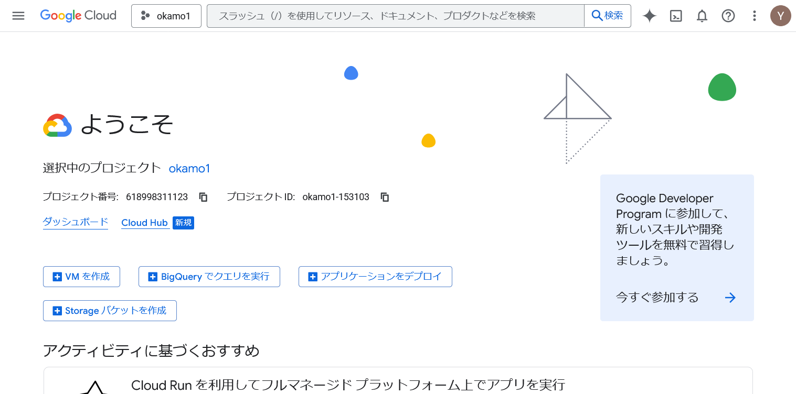

---

## 手順3: Gemini API Key を取得する

AIエージェントが使用する「Gemini API Key」を取得します。

1. 以下のURLにアクセスします

👉 https://aistudio.google.com/api-keys

2. 「APIキーを作成」ボタンをクリック

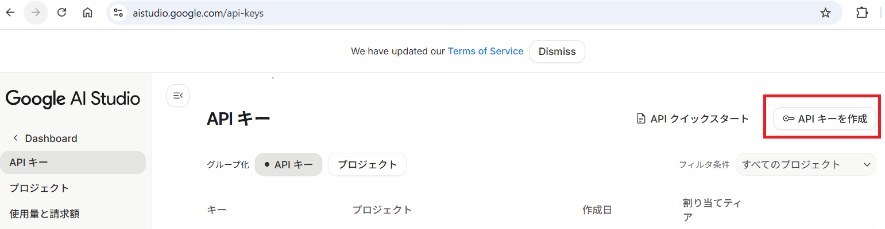

3. APIキーが作成されたら、「コピー」ボタンをクリック

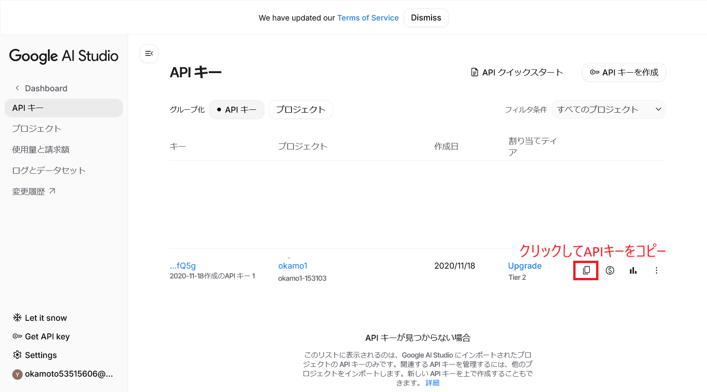

4. **コピーしたAPIキーをメモ帳などに保存しておいてください**

> **⚠️ 重要**  
> このAPIキーは後で使用します。必ずメモしておいてください！

---

## 手順4〜9: Firebase Studio でサイトを公開する

Firebase Studio を使って、まずは「Hello World」と表示されるだけのサイトを公開します。

1. 以下のURLにアクセスします

👉 https://studio.firebase.google.com/?hl=ja

2. 以下の文章を**そのままコピー＆ペースト**して、エンターキーを押します

```
App Name: MyHomepage
Core Features:
hello worldを表示するだけのアプリ
```

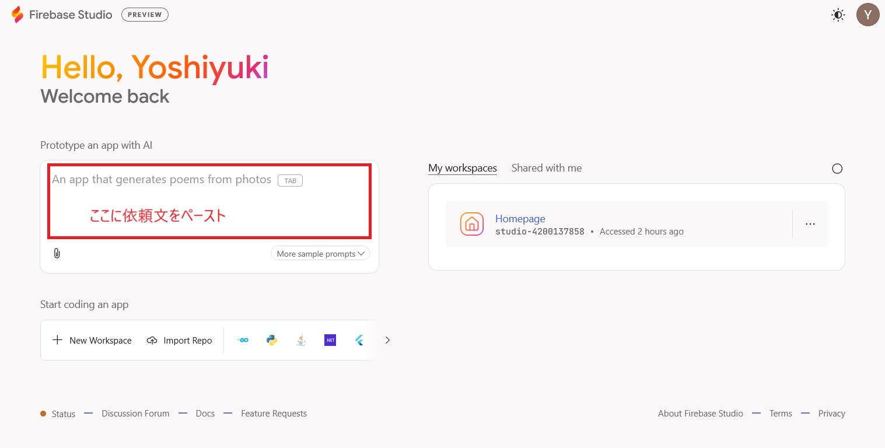

5. 「Prototype this App」ボタンをクリック

6. **数分待った後**、右上の「Publish」ボタンをクリック

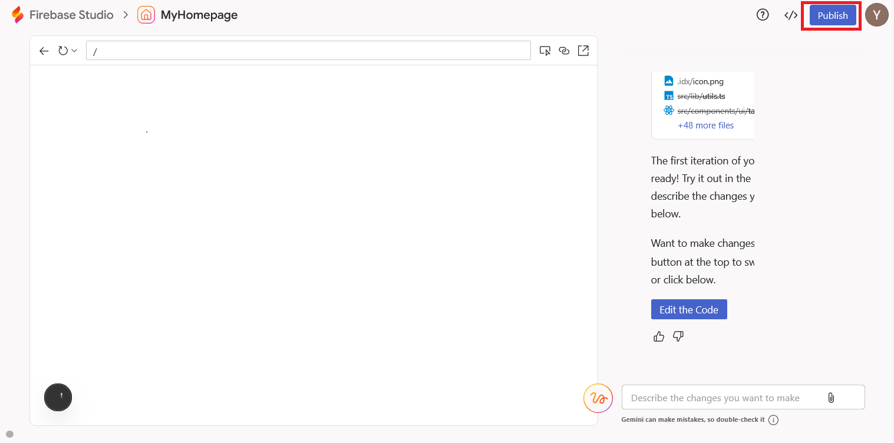

> **⏰ 補足**  
> 処理には数分かかることがあります。画面が動いていれば、そのままお待ちください。

7. 「Create a Cloud Billing account」のリンクが表示されたら、クリックしてクレジットカード情報などを登録

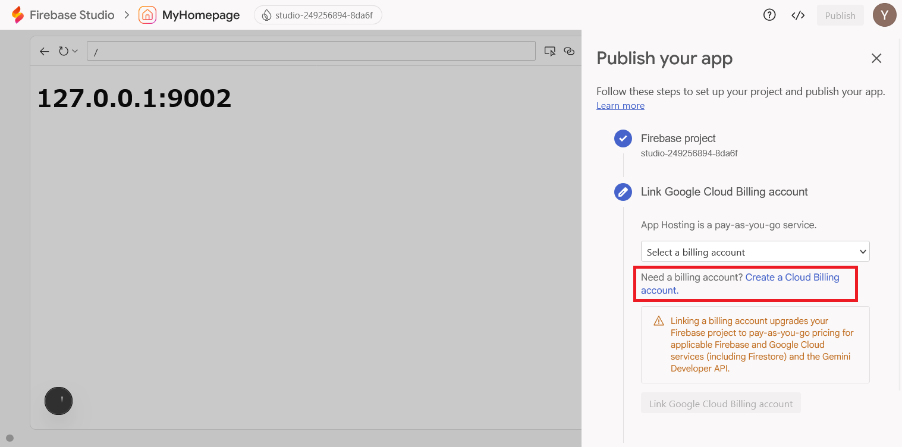

> **💳 課金について**  
> クレジットカードを登録しますが、このセットアップ手順で大きな費用は発生しません。  
> 無料枠の範囲内で十分に試すことができます。

8. 「Link Google Cloud Billing account」ボタンをクリック

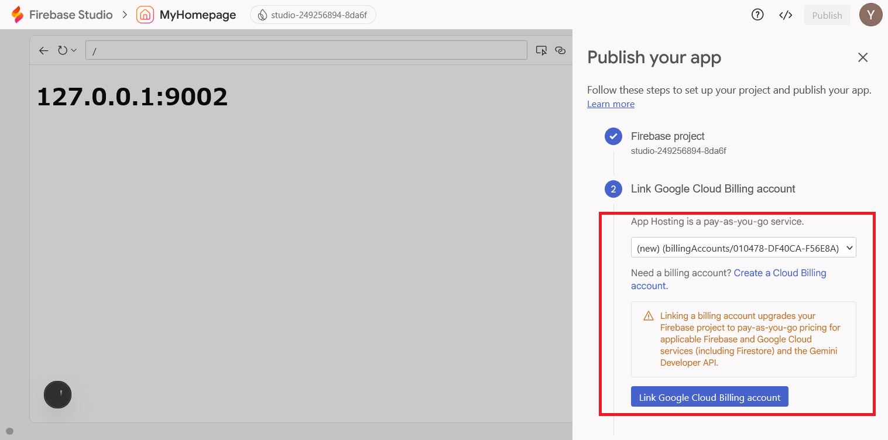

9. 「Set up services」ボタンをクリック


10. 「Publish now」ボタンをクリック

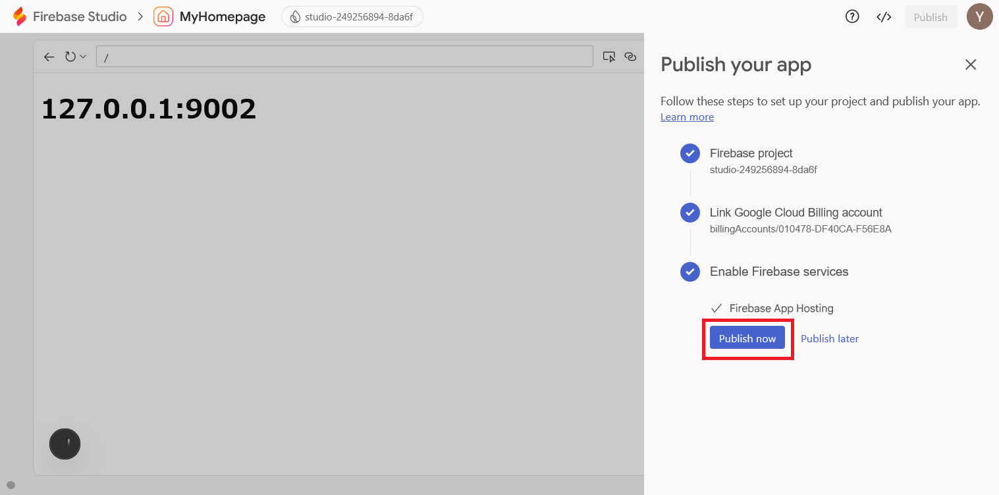

11. 処理が終わったら、「Visit your app」の下のURLをクリック

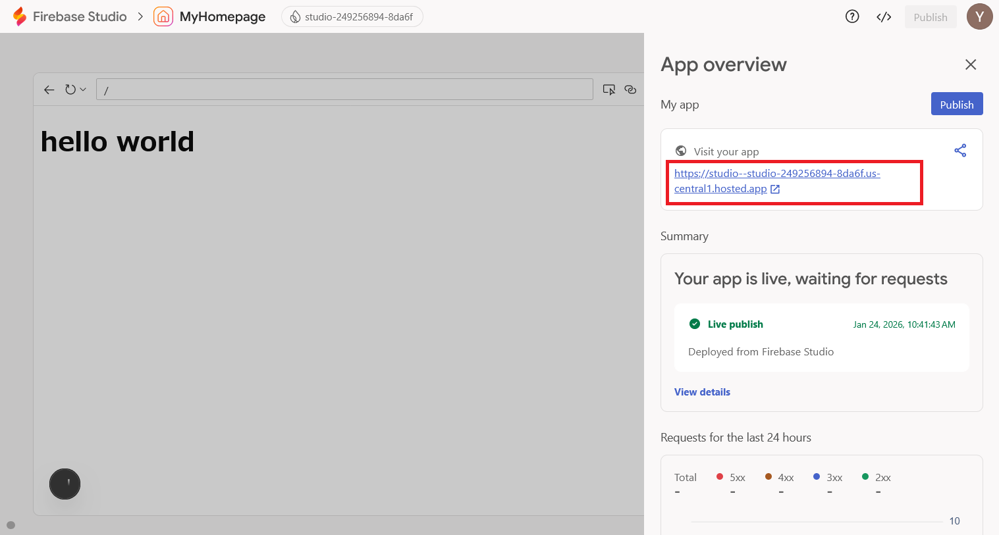

12. 「hello world」と表示されれば成功です！🎉


---

## 手順10: Firebase Studio でコード画面・ターミナルを開く

ここからは、Firebase Studio のコード画面とGeminiチャットを使って設定を行います。

1. Firebase Studio で右上の「</>」をクリック

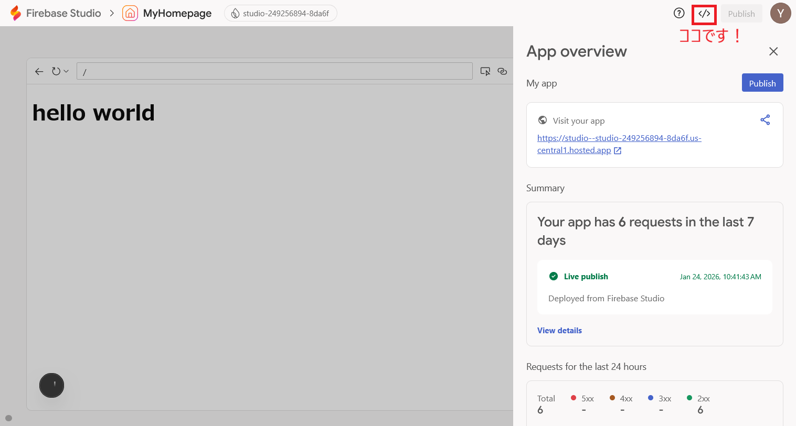

2. App overview の右の「×」ボタンをクリックして閉じる  
   次に、GEMINI の下の「＋」ボタンをクリック → 「New Chat」を選択

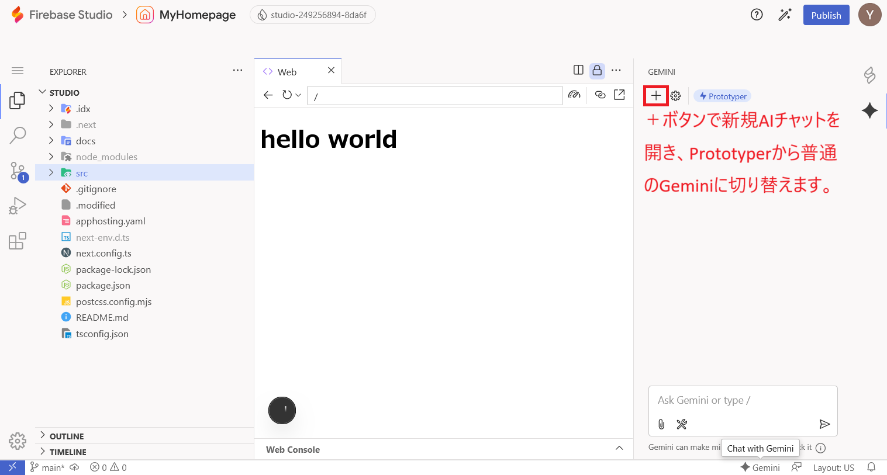

> **📌 ポイント**  
> 「New Chat」でGemini 3 Proに切り替えます。経験上、こちらの方がトラブルが少ないです。

3. 左上のハンバーガーメニュー（三本線マーク）から「Terminal」→「New Terminal」を選択

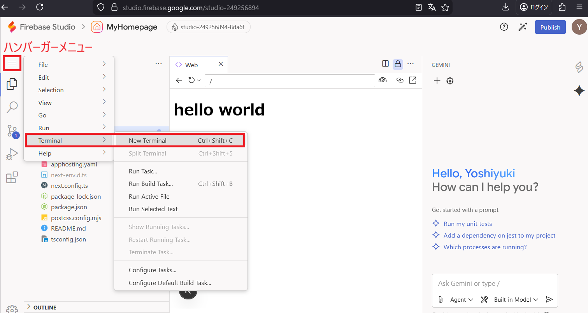

4. ターミナルが表示されます

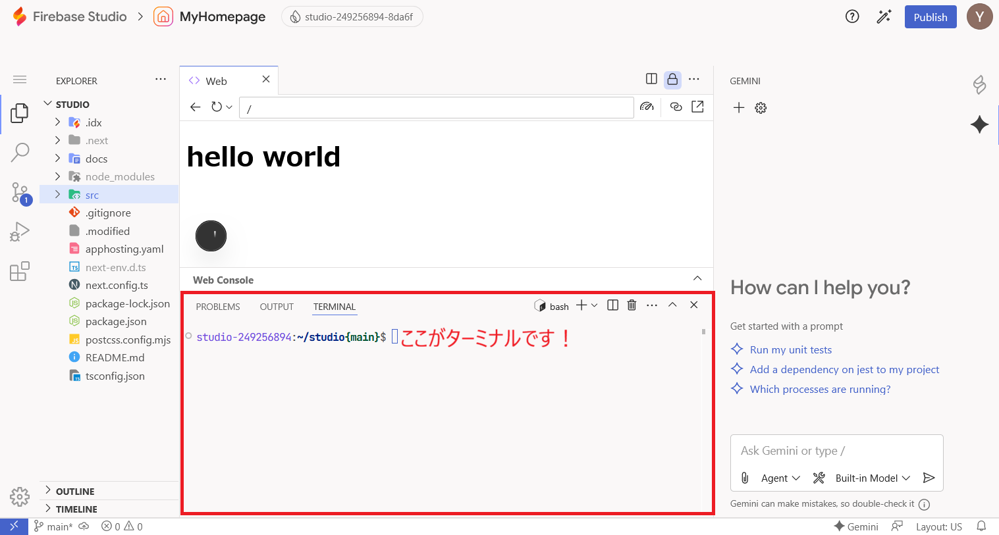

---

## 手順11: サービスアカウントを確認する

Firebase Studio で作ったアプリには、自動的にサービスアカウントが割り当てられます。  
このサービスアカウントに権限を付与することで、BigQuery や GA4 にアクセスできるようになります。

### 手順

1. GCPコンソール → 「IAMと管理」→「サービスアカウント」を開く
2. 以下の形式のサービスアカウントをメモしてください:

```
firebase-app-hosting-compute@studio-XXXXXXX.iam.gserviceaccount.com
```

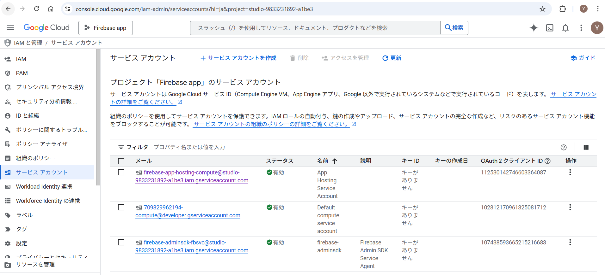

> **⚠️ `studio-XXXXXXX` の部分はプロジェクトごとに異なります**

---

## 手順12: BigQuery の IAM 権限設定

BigQuery のプロジェクトで、サービスアカウントにデータ参照権限を追加します。

### 手順

1. GCPコンソール → BigQuery のデータがあるプロジェクトの「IAMと管理」→「IAM」を開く
2. 「アクセスを許可」をクリック
3. 手順11でメモしたサービスアカウントを「新しいプリンシパル」に入力
4. 以下の **3つのロール** を付与:

| ロール | 説明 |
|--------|------|
| **BigQuery ジョブユーザー** | SQLクエリを実行するために必要 |
| **BigQuery データ閲覧者** | テーブルデータの読み取りに必要 |
| **BigQuery メタデータ閲覧者** | テーブル定義・スキーマの確認に必要 |

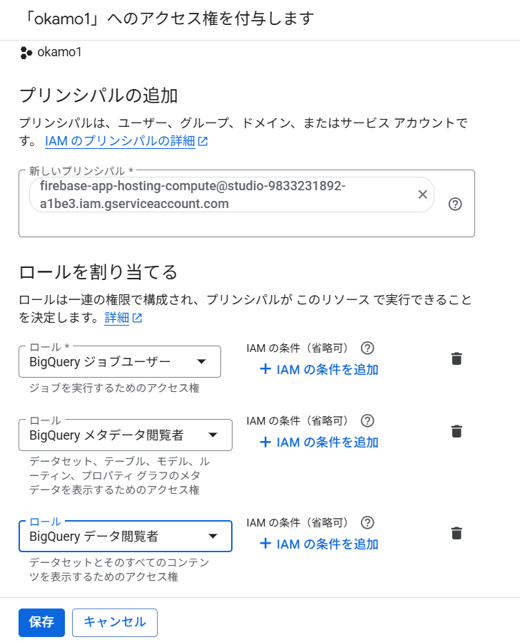

---

## 手順13: GA4 の閲覧権限設定

GA4（Google Analytics 4）の管理画面で、サービスアカウントにデータ閲覧権限を追加します。

### 手順

1. GA4 管理画面 → 「管理」→「アカウントのアクセス管理」を開く
2. 「＋」→「ユーザーを追加」をクリック
3. 手順11でメモしたサービスアカウントのメールアドレスを入力
4. 権限は **「閲覧者」** を選択
5. GA4 プロパティID（数字）をメモしておく（.envに設定します）

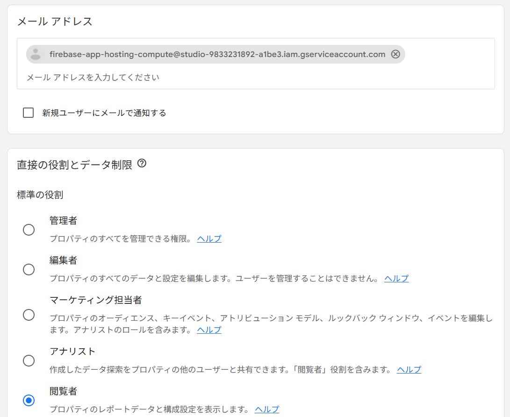

---

## 手順13.5: Google Analytics Data API を有効にする

Firebase Studio のプロジェクト（`studio-XXXXXXX`）側で、Google Analytics Data API を有効にする必要があります。  
これを有効にしないと、GA4 ツールからデータを取得する際に API エラーになります。

### 手順

1. 以下のURLにアクセスします（`studio-XXXXXXX` の部分はご自身のプロジェクトIDに置き換えてください）

👉 https://console.cloud.google.com/apis/library/analyticsdata.googleapis.com

2. プロジェクトが Firebase Studio のプロジェクト（`studio-XXXXXXX`）になっていることを確認
3. 「有効にする」ボタンをクリック

> **⚠️ 重要**  
> BigQuery のプロジェクトではなく、**Firebase Studio のプロジェクト**（`studio-〜`）で有効にしてください。  
> エージェントアプリは Firebase Studio のプロジェクトで動作するため、API もそちらで有効にする必要があります。

> **📌 API名の確認**  
> 正式名称は「Google Analytics Data API」（`analyticsdata.googleapis.com`）です。  
> 「Google Analytics Admin API」や「Google Analytics API」とは別物なので注意してください。

---

## 手順14: 環境変数の設定

Firebase Studio のターミナルで `.env` ファイルを編集し、以下の環境変数を設定します。

```bash
# .env ファイル
GEMINI_API_KEY=xxxxxxxxxxxxxxx          # 手順3で取得したAPIキー（自動設定済みの場合あり）
BIGQUERY_PROJECT_ID=your-project-id      # BigQueryのプロジェクトID
GA_PROPERTY_ID=123456789                 # GA4のプロパティID（数字）
```

> **📌 `GOOGLE_APPLICATION_CREDENTIALS`** について  
> Firebase Studio 環境では ADC（Application Default Credentials）が自動で設定されるため、通常は不要です。  
> ローカル開発等で明示的に指定したい場合のみ設定してください。

---

## 手順15〜20: Gemini への指示プロンプト履歴

以下のプロンプトを **順番に** Firebase Studio の Gemini チャットに貼り付けて実行しました。  
各プロンプトの全文は `docs/` フォルダ内の対応ファイルに保存されています。

### プロンプト1: ベースアプリ作成（BigQuery エージェント）

📄 **ファイル:** [gemini-prompt.md](docs/gemini-prompt.md)

Hello World アプリを、Genkit + BigQuery を使った AI データ分析エージェントに改修する指示です。

**作成されるファイル:**
| ファイル | 内容 |
|----------|------|
| `src/ai/genkit.ts` | Genkit初期化（既存・変更なし） |
| `src/ai/agent.ts` | エージェントフロー定義 |
| `src/ai/tools/bigquery.ts` | BigQueryツール（executeBigQuery, listDatasets） |
| `src/ai/dev.ts` | Genkit devツール用エントリポイント |
| `src/lib/bigquery-client.ts` | BigQueryクライアント（ADC認証） |
| `src/lib/bigquery-schema.ts` | データセット説明定数 |
| `src/app/api/agent/route.ts` | APIルート（POST） |
| `src/app/page.tsx` | チャットUI（shadcn/ui） |
| `scripts/test-tools.ts` | BigQueryツール単体テスト |
| `scripts/test-agent.ts` | エージェント全体テスト |

**テスト方法:**
```bash
# ターミナルでテスト
npx tsx scripts/test-agent.ts "データセットの一覧を教えて"
```

---

### プロンプト2: GA4 MCP 連携追加

📄 **ファイル:** [gemini-prompt-ga4-mcp.md](docs/gemini-prompt-ga4-mcp.md)

`@genkit-ai/mcp` を使って GA4 MCP サーバー（`mcp-server-ga4`）に接続し、GA4 のアクセス解析データも取得できるようにする指示です。

**追加・変更されるファイル:**
| ファイル | 内容 |
|----------|------|
| `src/ai/mcp.ts` | MCP Host 設定（GA4サーバーへのstdio接続） |
| `src/ai/agent.ts` | GA4ツールを統合したエージェントに修正 |
| `package.json` | `@genkit-ai/mcp` を追加 |

---

### プロンプト3: GA4 MCP スキーマクラッシュ修正

📄 **ファイル:** [gemini-prompt-ga4-mcp-fix-b.md](docs/gemini-prompt-ga4-mcp-fix-b.md)

GA4 MCP ツールの JSON Schema に `type: "object"` だが `properties` が未定義のフィールド（例: `dimensionFilter`）があり、`@genkit-ai/google-genai` 内部の `toGeminiSchemaProperty` が `Object.keys(undefined)` でクラッシュする問題の修正です。

**根本原因:**
```json
// ga4/runReport の dimensionFilter — properties がない
{ "type": "object", "description": "Filter for dimensions" }
```

**解決策:** スキーマを再帰的に走査し、`properties` が未定義なら `{}` を補完するパッチ関数を作成。

**追加されるファイル:**
| ファイル | 内容 |
|----------|------|
| `src/ai/mcp-schema-fix.ts` | `patchSchema()` — 再帰的スキーマパッチ関数 |

---

### プロンプト4: 画面（UI）が動作しない問題の修正

📄 **ファイル:** [gemini-prompt-ui-fix.md](docs/gemini-prompt-ui-fix.md)

CLIテスト（`npx tsx scripts/test-agent.ts`）では動くのに、チャットUIから呼び出すと動かない問題の修正です。

**原因1:** API ルートが `dataAgent(query)` と文字列を直接渡していた  
**修正:** `dataAgent({ query })` とオブジェクトで渡す

**原因2:** `agent.ts` の `finally` で毎回 `mcpHost.close()` を呼んでいたため、2回目以降のリクエストで GA4 MCP サーバーが終了済み  
**修正:** `mcpHost.close()` を削除し、MCPホストをシングルトンとして維持

---

### プロンプト5: GA4 INVALID_ARGUMENT エラー修正

📄 **ファイル:** [gemini-prompt-ga4-params-fix.md](docs/gemini-prompt-ga4-params-fix.md)

LLM が GA4 ツールに渡すパラメータ形式が正しくない問題の修正です。  
システムプロンプトに各 GA4 ツールの正確なパラメータ形式（`runReport` は `[{name: "xxx"}]` 形式等）を追記する指示です。

> **📌 教訓:** この修正だけでは不十分でした。LLM がそもそも GA4 ツールを選択しない問題が残りました。

---

### プロンプト6: GA4 ツールが選択されない問題の修正（最終修正）

📄 **ファイル:** [gemini-prompt-ga4-routing-fix.md](docs/gemini-prompt-ga4-routing-fix.md)

**最も重要な修正です。** MCPツールを直接LLMに渡す方式から、`ai.defineTool` でシンプルなラッパーツールを作成する方式に変更しました。

**問題:** MCP由来の複雑なスキーマをLLMに渡すと、LLMがGA4ツールを理解できずBigQueryだけで回答してしまう  
**解決:** シンプルなZodスキーマ + 日本語descriptionのラッパーツール5つを作成

**追加されるファイル:**
| ファイル | 内容 |
|----------|------|
| `src/ai/tools/ga4.ts` | GA4ラッパーツール5つの定義 |

**ラッパーツール一覧:**
| ツール名 | 機能 | 工夫 |
|----------|------|------|
| `getGA4ActiveUsers` | アクティブユーザー数 | — |
| `getGA4PageViews` | ページビュー数 | dimensions未指定時 `["date"]` を自動付与 |
| `getGA4Events` | イベントデータ | — |
| `getGA4UserBehavior` | ユーザー行動 | — |
| `runGA4Report` | カスタムレポート | 文字列配列→オブジェクト配列に自動変換 |

**テスト方法:**
```bash
npx tsx scripts/test-agent.ts "今日のアクティブユーザー数を教えてください"
npx tsx scripts/test-agent.ts "直近7日間のページビュー数は？"
```

---

### プロンプト7: MCP 依存を除去し GA4 Data API 直接呼び出しに変更

📄 **ファイル:** [gemini-prompt-remove-mcp.md](docs/gemini-prompt-remove-mcp.md)

プロンプト2〜6で構築した MCP 経由の GA4 連携を廃止し、`@google-analytics/data`（BetaAnalyticsDataClient）で GA4 Data API を直接呼び出す方式に変更する指示です。

**変更理由:** プロンプト2〜6の過程で MCP の課題（スキーマクラッシュ、LLMのツール選択失敗、パラメータ形式不一致）が判明し、結局ラッパーツールを書いたため MCP のメリットがなくなった。

**変更内容:**
| 操作 | ファイル | 内容 |
|------|----------|------|
| 新規作成 | `src/lib/ga4-client.ts` | GA4クライアント（ADC認証・シングルトン） |
| 完全書き換え | `src/ai/tools/ga4.ts` | MCP呼び出し → `client.runReport()` 直接呼び出し |
| 更新 | `scripts/test-ga4-direct.ts` | MCPなしのAPIテスト |
| 削除 | `src/ai/mcp.ts` | MCP Host 設定（不要） |
| 削除 | `src/ai/mcp-schema-fix.ts` | MCPスキーマパッチ（不要） |
| パッケージ追加 | `@google-analytics/data` | GA4 Data API クライアント |
| パッケージ削除 | `@genkit-ai/mcp` | MCP依存の除去 |

**テスト方法:**
```bash
# GA4 API 直接テスト
npx tsx scripts/test-ga4-direct.ts

# エージェント経由テスト
npx tsx scripts/test-agent.ts "今日のアクティブユーザー数を教えてください"
```

---

## 開発中に得られた教訓

### Genkit × MCP の課題

今回の開発を通じて、**Genkit で MCP ツールを使うよりも、独自ツール（`ai.defineTool`）で実装した方が安定する**ことがわかりました。

| MCP経由で発生した問題 | 独自ツールなら |
|---|---|
| スキーマに `properties: null` → Genkit内部でクラッシュ | Zodで明確に定義、問題なし |
| LLMがツールを選択しない（スキーマが複雑すぎる） | descriptionを自由に書ける |
| パラメータ形式の不一致（`[{name:"x"}]` vs `["x"]`） | 入出力を完全にコントロール可能 |
| dimensions必須なのにスキーマ上optional | バリデーション・デフォルト値を自由に設定 |

結局ラッパーツールを書いた時点で、MCPの「ツール定義を自動取得」というメリットがほぼ消えています。  
GA4 Data API を直接叩く `ai.defineTool` を書いた方が、コード量も依存も少なく済みます。

---

## 手順21: 本番サイトに反映する

すべての修正が完了したら、本番サイトに反映（デプロイ）します。

### 手順

1. 右上の「Publish」ボタンをクリック


2. 「Publish」ボタンをクリック


> **⏰ デプロイには数分かかります**  
> 完了するまでお待ちください。

---

## 最終的なファイル構成（プロンプト7適用後）

```
src/
├── ai/
│   ├── genkit.ts              # Genkit初期化
│   ├── agent.ts               # エージェントフロー
│   ├── dev.ts                 # Genkit dev用
│   └── tools/
│       ├── bigquery.ts        # BigQueryツール
│       └── ga4.ts             # GA4ツール（Data API直接呼び出し）
├── lib/
│   ├── bigquery-client.ts     # BigQueryクライアント
│   ├── bigquery-schema.ts     # データセット説明
│   └── ga4-client.ts          # GA4クライアント（ADC認証）
└── app/
    ├── api/agent/route.ts     # APIエンドポイント
    └── page.tsx               # チャットUI
scripts/
├── test-agent.ts              # エージェントテスト
├── test-tools.ts              # ツール単体テスト
└── test-ga4-direct.ts         # GA4 API直接テスト
docs/
├── setup1.md                  # この手順書
├── gemini-prompt.md           # プロンプト1: ベースアプリ
├── gemini-prompt-ga4-mcp.md   # プロンプト2: GA4 MCP追加
├── gemini-prompt-ga4-mcp-fix-b.md  # プロンプト3: スキーマ修正
├── gemini-prompt-ui-fix.md    # プロンプト4: UI修正
├── gemini-prompt-ga4-params-fix.md # プロンプト5: パラメータ修正
├── gemini-prompt-ga4-routing-fix.md # プロンプト6: ルーティング修正
└── gemini-prompt-remove-mcp.md     # プロンプト7: MCP除去
```
